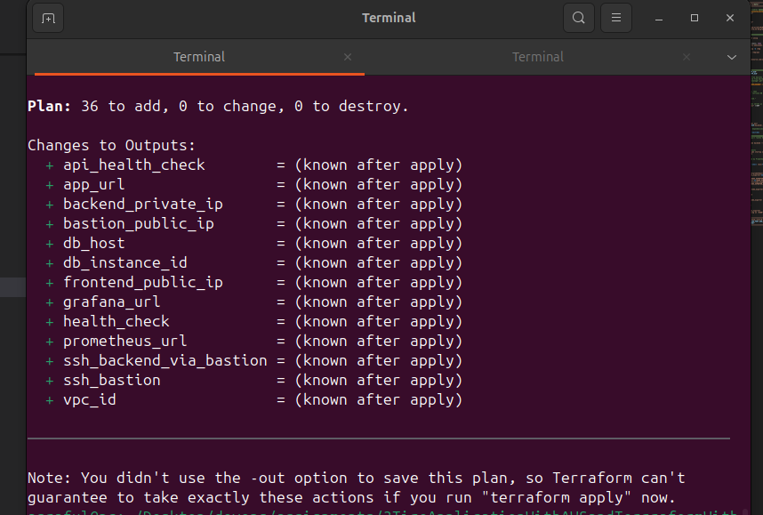
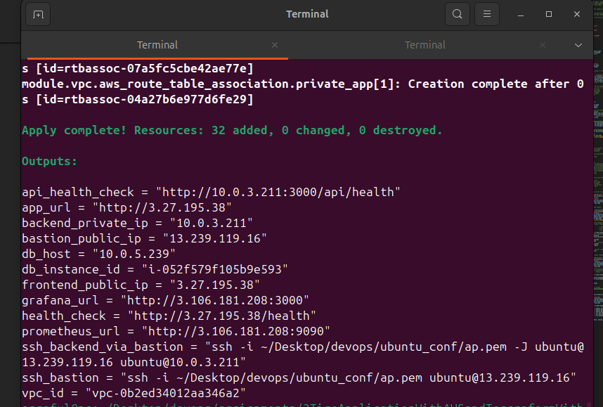
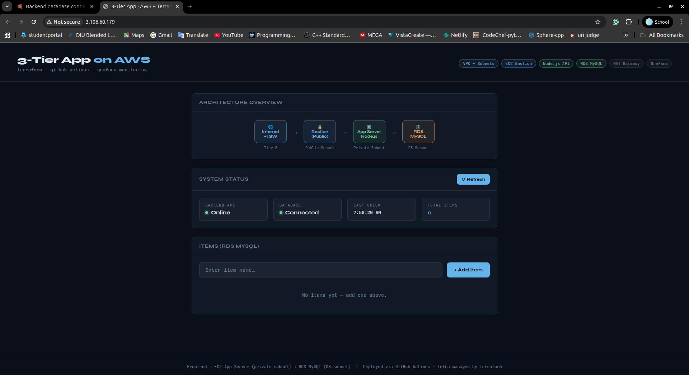
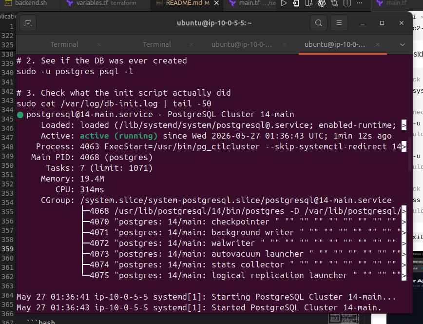
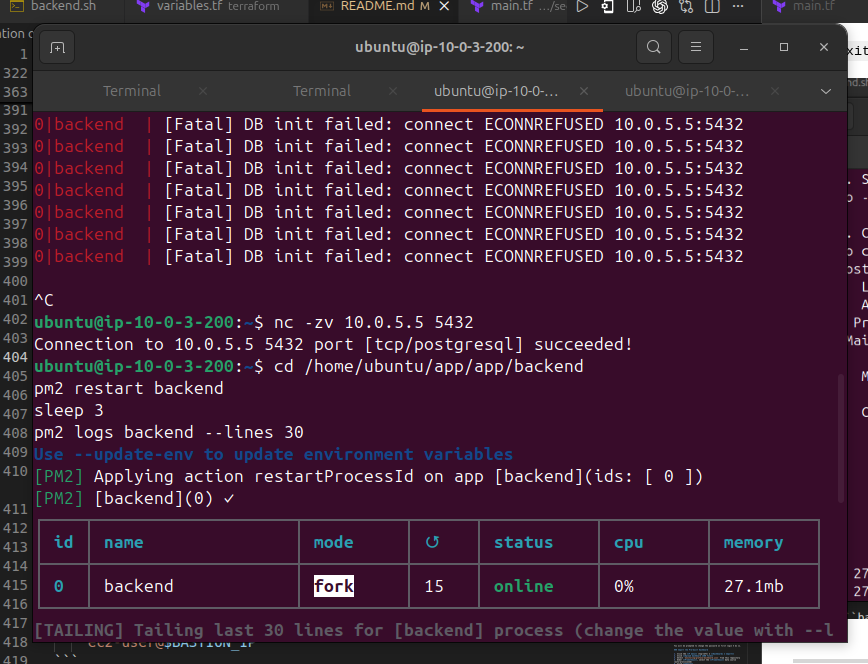
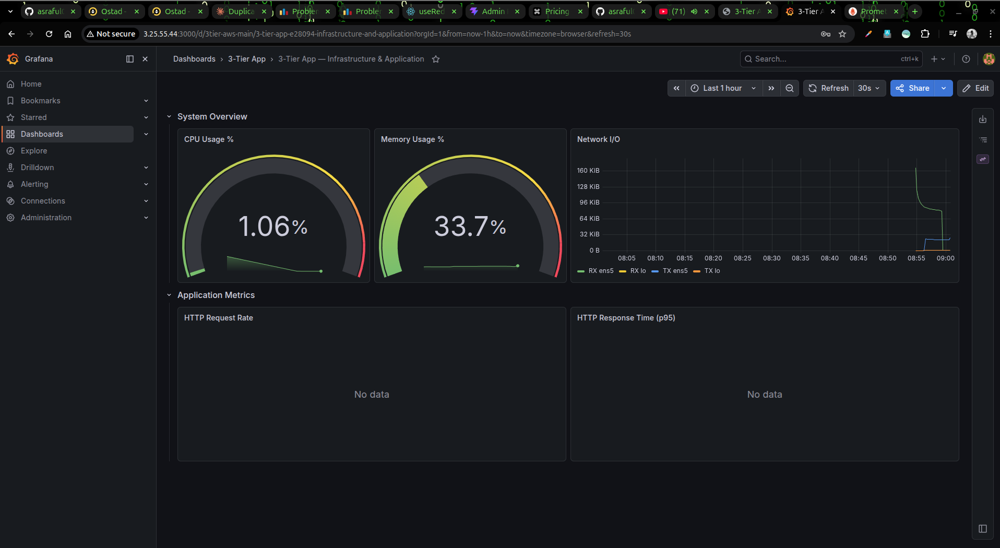
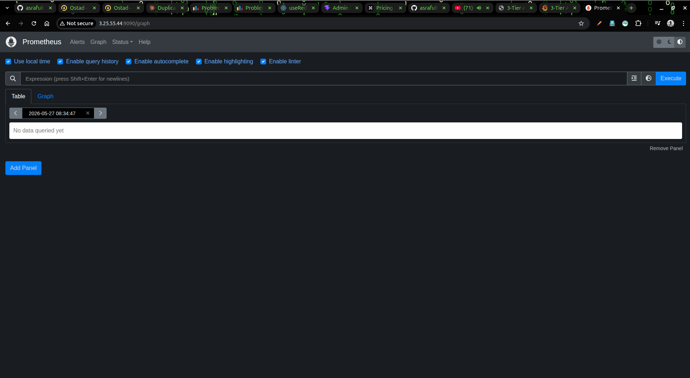

# 3-Tier Application on AWS — Terraform + GitHub Actions + Grafana
---

##  Project Structure

```
3tier-aws-terraform/
│
├── terraform/
│   ├── main.tf                        # Root module — wires all modules
│   ├── variables.tf                   # All input variable declarations
│   ├── outputs.tf                     # Exposes IPs & URLs after apply
│   ├── terraform.tfvars.example       # Template — copy to terraform.tfvars
│   │
│   └── modules/
│       ├── vpc/                       # VPC, subnets, IGW, NAT, route tables
│       │   ├── main.tf
│       │   ├── variables.tf
│       │   └── outputs.tf
│       │
│       ├── security-groups/           # SGs: bastion, app, postgres, monitoring
│       │   ├── main.tf
│       │   ├── variables.tf
│       │   └── outputs.tf
│       │
│       ├── compute/                   # Bastion EC2 + App Server EC2
│       │   ├── main.tf
│       │   ├── variables.tf
│       │   ├── outputs.tf
│       │   └── user_data.sh.tpl      # Bootstrap: Node.js + PM2 + app code
│       │
│       ├── db-ec2/                  # PostgreSQL 15 on private EC2
│       │   ├── main.tf
│       │   ├── variables.tf
│       │   ├── outputs.tf
│  
│
├── app/
│   ├── backend/
│   │   ├── server.js                  # Express.js API (uses pg driver)
│   │   ├── server.test.js             # Jest tests (pg mocked)
│   │   ├── package.json
│   │   └── .env.example
│   │
│   └── frontend/
│       └── index.html                 # SPA: arch diagram + CRUD UI
│
├── monitoring/
│   └── grafana-dashboard.json         # Pre-built Grafana dashboard
│
├── .github/
│   └── workflows/
│       ├── deploy.yml                 # CI/CD pipeline
│       └── destroy.yml                # Manual teardown
│
├── .gitignore
└── README.md
```

---

## 4. Prerequisites

| Tool | Minimum version | Install |
|---|---|---|
| Terraform | 1.6.0 | https://developer.hashicorp.com/terraform/downloads |
| AWS CLI | 2.x | https://aws.amazon.com/cli/ |
| Git | any | https://git-scm.com |
| Node.js (local dev only) | 18 LTS | https://nodejs.org |

**AWS IAM permissions required:**

My IAM user or role needs the following (attach as managed or inline policies):

```
AmazonEC2FullAccess
AmazonVPCFullAccess
```

---

## 5. Step-by-Step: Local Terraform Deployment

### 5.1 Install Required Tools

**Terraform (Linux/macOS):**
```bash
# macOS
brew tap hashicorp/tap
brew install hashicorp/tap/terraform

# Linux (Debian/Ubuntu)
wget -O- https://apt.releases.hashicorp.com/gpg | sudo gpg --dearmor -o /usr/share/keyrings/hashicorp-archive-keyring.gpg
echo "deb [signed-by=/usr/share/keyrings/hashicorp-archive-keyring.gpg] https://apt.releases.hashicorp.com $(lsb_release -cs) main" | sudo tee /etc/apt/sources.list.d/hashicorp.list
sudo apt update && sudo apt install terraform

# Verify
terraform -version   # should show >= 1.6.0
```

**AWS CLI:**
```bash
# macOS
brew install awscli

# Linux
curl "https://awscli.amazonaws.com/awscli-exe-linux-x86_64.zip" -o awscliv2.zip
unzip awscliv2.zip && sudo ./aws/install

# Verify
aws --version
```

---

### 5.2 Configure AWS Credentials

```bash
aws configure
```

You will be prompted for:
```
AWS Access Key ID:      <My-iam-access-key>
AWS Secret Access Key:  <My-iam-secret-key>
Default region name:    ap-southeast-2
Default output format:  json
```

Verify access works:
```bash
aws sts get-caller-identity
# Should print My account ID and IAM user ARN
```

---

### 5.3 Find the Correct AMI ID for My Region

The default `ami_id` in `terraform.tfvars.example` is for **ap-southeast-2**.  
If you are using a different region, look up the current Amazon Linux 2 AMI:

```bash
aws ec2 describe-images \
  --owners amazon \
  --filters "Name=name,Values=amzn2-ami-hvm-*-x86_64-gp2" \
            "Name=state,Values=available" \
  --query "sort_by(Images, &CreationDate)[-1].ImageId" \
  --output text \
  --region ap-southeast-2     # ← change to My region
```

Copy the returned AMI ID (e.g. `ami-040e84e83dc8dae53`) into My `terraform.tfvars`.

---

### 5.4 Create an EC2 Key Pair if not exit

All three EC2 instances (bastion, app server, postgres) use the same key pair for SSH access.

```bash
# Create the key pair and save the private key
aws ec2 create-key-pair \
  --key-name ap \
  --query 'KeyMaterial' \
  --output text > ~/Desktop/devops/ubuntu_conf/ap.pem

# Lock down permissions (required by SSH)
chmod 400 ~/Desktop/devops/ubuntu_conf/ap.pem

# Verify it was created
aws ec2 describe-key-pairs --key-names ap
```

> If you already have a key pair you want to reuse, note its name and skip the creation step.

---

### 5.5 Find My Public IP

You will restrict SSH access to My IP only (recommended):

```bash
curl -s https://checkip.amazonaws.com
# Example output: 203.0.113.5
```

My `my_ip_cidr` value will be that IP with `/32` appended, e.g. `"203.0.113.5/32"`.

---

### 5.6 Clone the Repository

```bash
git clone https://github.com/asraful0106/3tireApplicationWith_teraform_CI-CD_grafana
cd 3tireApplicationWith_teraform_CI-CD_grafana
```

---

### 5.7 Configure Terraform Variables

```bash
cd terraform
cp terraform.tfvars.example terraform.tfvars
```

Open `terraform.tfvars` in any editor and fill in My values:

```hcl
# terraform/terraform.tfvars

aws_region   = "ap-southeast-2"       # My AWS region
project_name = "three-tier-app"
environment  = "prod"

# Networking — keep defaults unless you have conflicts
vpc_cidr             = "10.0.0.0/16"
public_subnet_cidrs  = ["10.0.1.0/24", "10.0.2.0/24"]
private_subnet_cidrs = ["10.0.10.0/24", "10.0.11.0/24"]
db_subnet_cidrs      = ["10.0.20.0/24", "10.0.21.0/24"]
availability_zones   = ["ap-southeast-2a", "ap-southeast-2b"]

# My public IP with /32 — get it from step 5.5
my_ip_cidr = "203.0.113.5/32"

# AMI — from step 5.3 (ap-southeast-2 default shown)
ami_id = "ami-040e84e83dc8dae53"

# EC2 instance types (t2.micro is free-tier eligible)
bastion_instance_type    = "t2.micro"
app_instance_type        = "t2.micro"
db_instance_type         = "t2.micro"     # PostgreSQL EC2
monitoring_instance_type = "t2.small"

# My key pair name from step 5.4
key_name = "ap"

app_port = 3000

# PostgreSQL database credentials
db_name           = "appdb"
db_username       = "appuser"
db_password       = "MyStr0ngP@ssword!"   # use something strong
db_volume_size_gb = 20
```

---

### 5.8 Initialise Terraform

```bash
# Still inside the terraform/ directory
terraform init
```

Expected output:
```
Initializing the backend...
Initializing modules...
- module.vpc
- module.security_groups
- module.postgres
- module.compute
- module.monitoring

Initializing provider plugins...
- Finding hashicorp/aws versions matching "~> 5.0"...
- Installing hashicorp/aws v5.x.x...

Terraform has been successfully initialized!
```

Run a format and validation check:
```bash
terraform fmt -recursive    # auto-formats all .tf files
terraform validate          # checks for syntax/logic errors
```

---

### 5.9 Preview the Plan

```bash
terraform plan
```

This shows every resource that will be created — **nothing is built yet**.



---

### 5.10 Apply — Create All AWS Resources

```bash
terraform apply
```

Review the plan one more time, then type `yes` and press Enter.

```
Do you want to perform these actions?
  Terraform will perform the actions described above.
  Only 'yes' will be accepted to approve.

  Enter a value: yes
```

This takes approximately **3–6 minutes**. 



---

### 5.11 Wait for Bootstrap to Complete

The EC2 instances run bootstrap scripts (`user_data`) automatically on first boot.  
PostgreSQL setup takes about **2–3 minutes** after the instance shows "running".  
The app server takes about **1–2 minutes** after that (it waits for npm install).


---

### 5.12 Verify PostgreSQL is Running

SSH to the postgres server and run a quick check:

```bash
POSTGRES_IP=$(terraform output -raw postgres_private_ip)
BASTION_IP=$(terraform output -raw bastion_public_ip)

ssh -J ec2-user@$BASTION_IP \
    -i ~/Desktop/devops/ubuntu_conf/ap.pem \
    ec2-user@$POSTGRES_IP
```

Once inside:

```bash
# Check the service is running
sudo systemctl status postgresql-15

# Connect with psql and verify the database
sudo -u postgres psql -d appdb -c "\dt"
# Should show the items table

sudo -u postgres psql -d appdb -c "SELECT * FROM items;"
# Should show an empty table (or any seeded rows)

# Check listening port
sudo ss -tlnp | grep 5432
# Should show 0.0.0.0:5432
```

Type `exit` to leave the postgres server.




---

### 5.13 Verify the Application is Running

SSH to the app server via the bastion:

```bash
APP_IP=$(terraform output -raw app_private_ip)
BASTION_IP=$(terraform output -raw bastion_public_ip)

ssh -J ec2-user@$BASTION_IP \
    -i ~/Desktop/devops/ubuntu_conf/ap.pem \
    ec2-user@$APP_IP
```

Inside the app server:

```bash
# Check PM2 status
pm2 status
# NAME         STATUS   CPU   MEM
# 3tier-app    online   0%    xx MB  ✓

# Check app logs
pm2 logs 3tier-app --lines 20

# Test the API directly
curl http://localhost:3000/api/health
# {"status":"ok","db":"connected","timestamp":"..."}

curl http://localhost:3000/api/items
# []

# Test POST
curl -X POST http://localhost:3000/api/items \
  -H "Content-Type: application/json" \
  -d '{"name":"hello from EC2"}'
# {"id":1,"name":"hello from EC2","created_at":"..."}
```

Type `exit` to leave.




---

## 6. Step-by-Step: GitHub Actions CI/CD

### 6.1 Push to GitHub

```bash
cd 3tier-aws-terraform   # repo root

git init                 # if not already a git repo
git add .
git commit -m "Initial commit: 3-tier app with Terraform + PostgreSQL EC2"

# Create the repo on GitHub, then:
git remote add origin https://github.com/asraful0106/3tireApplicationWith_teraform_CI-CD_grafana
git branch -M main
git push -u origin main
```

---

### 6.2 Add Repository Secrets

GitHub repo → **Settings → Secrets and variables → Actions → New repository secret**

Add each of the following:

| Secret Name | Value | How to get it |
|---|---|---|
| `AWS_ACCESS_KEY_ID` | My IAM access key | AWS Console → IAM → Users → Security credentials |
| `AWS_SECRET_ACCESS_KEY` | My IAM secret key | Same as above |
| `AWS_REGION` | `ap-southeast-2` | My chosen AWS region |
| `TF_VAR_KEY_NAME` | `ap` | The key pair name from step 5.4 |
| `TF_VAR_DB_PASSWORD` | `MyStr0ngP@ssword!` | Same as `db_password` in terraform.tfvars |
| `TF_VAR_MY_IP_CIDR` | `0.0.0.0/0` | Or My IP/32 — used for SSH allowlist |
| `EC2_SSH_PRIVATE_KEY` | Full contents of `~/Desktop/devops/ubuntu_conf/ap.pem` | `cat ~/Desktop/devops/ubuntu_conf/ap.pem` |


---

### 6.3 Create a Production Environment

This adds a manual approval gate before `terraform apply` runs.

1. Go to repo → **Settings → Environments → New environment**
2. Name it exactly: `production`
3. Under **Deployment protection rules**, enable **Required reviewers**
4. Add Myself as a required reviewer
5. Click **Save protection rules**

---

### 6.4 Trigger the Pipeline

**On Pull Request:** The pipeline runs `terraform plan` and posts the result as a PR comment.

```bash
git checkout -b feature/update-something
# make a change
git add . && git commit -m "Update something"
git push origin feature/update-something
# Open a PR on GitHub → pipeline runs plan automatically
```

**On push to main:** The full pipeline runs (test → apply → deploy).

```bash
git checkout main
git merge feature/update-something
git push origin main
# → GitHub Actions runs automatically
# → You will get an approval request in the "production" environment
# → Approve it → Terraform applies → App code is deployed via SSH
```

---

### 6.5 How the Pipeline Works

```
Push to main / Pull Request
         │
         ▼
┌─────────────────────────────────────────────────────────────┐
│  Job 1: test (always runs)                                  │
│  ┌───────────────────────────────────────────────────────┐  │
│  │  npm ci  →  npm run lint  →  npm test (Jest + pg mock) │  │
│  └───────────────────────────────────────┬───────────────┘  │
│                                          │                  │
│              ┌───────────────────────────┤                  │
│              │ PR?          │ Push to main?                 │
│              ▼              ▼                               │
│  ┌──────────────────┐  ┌───────────────────────────────┐   │
│  │ Job 2: plan      │  │ Job 3: apply + deploy         │   │
│  │                  │  │ (requires env approval)        │   │
│  │ terraform init   │  │                               │   │
│  │ terraform fmt    │  │ terraform init                │   │
│  │ terraform plan   │  │ terraform apply -auto-approve │   │
│  │ Post to PR ✓     │  │ rsync app/backend/ via SSH    │   │
│  └──────────────────┘  │ pm2 restart 3tier-app         │   │
│                        │ Print deployment summary       │   │
│                        └───────────────────────────────┘   │
└─────────────────────────────────────────────────────────────┘
```

The deploy step uses `rsync` through an SSH ProxyJump (bastion → app server) to push updated `app/backend/` files, then restarts the app with PM2 — zero-downtime rolling update.

---

## 7. Step-by-Step: Grafana Monitoring

### Access Grafana

```bash
terraform output grafana_url
# http://18.x.x.x:3000
```

Open that URL in My browser.

**Default credentials:**
```
Username: admin
Password: admin
```

You will be prompted to change the password on first login — do so.

### Import the Pre-built Dashboard

1. Click the **☰ menu** (top-left) → **Dashboards → Import**
2. Click **Upload dashboard JSON file**
3. Select `monitoring/grafana-dashboard.json` from this repository
4. Under **Prometheus**, select the **Prometheus** data source (auto-provisioned)
5. Click **Import**

You will now see the **3-Tier App — Infrastructure & Application** dashboard with:
- **CPU Usage %** — gauge, threshold-coloured (green/yellow/red)
- **Memory Usage %** — gauge
- **Network I/O** — time series (bytes/s received and transmitted)
- **HTTP Request Rate** — requests/second by route
- **HTTP Response Time p95** — latency in seconds

### How Prometheus Scrapes Metrics

The Grafana EC2 runs Prometheus, which is configured (via `grafana_setup.sh.tpl`) to scrape:

```yaml
scrape_configs:
  - job_name: 'node-exporter'
    static_configs:
      - targets: ['<app_private_ip>:9100']   # OS metrics from app server

  - job_name: 'three-tier-app'
    metrics_path: '/metrics'
    static_configs:
      - targets: ['<app_private_ip>:3000']   # App-level metrics (if exposed)
```




### Explore Prometheus Directly

```
http://<grafana_public_ip>:9090
```


Try these queries in the Prometheus UI:
```
# CPU usage
100 - (avg by(instance)(rate(node_cpu_seconds_total{mode="idle"}[5m])) * 100)

# Memory available
node_memory_MemAvailable_bytes / node_memory_MemTotal_bytes * 100

# Network receive rate
rate(node_network_receive_bytes_total[5m])
```

---

